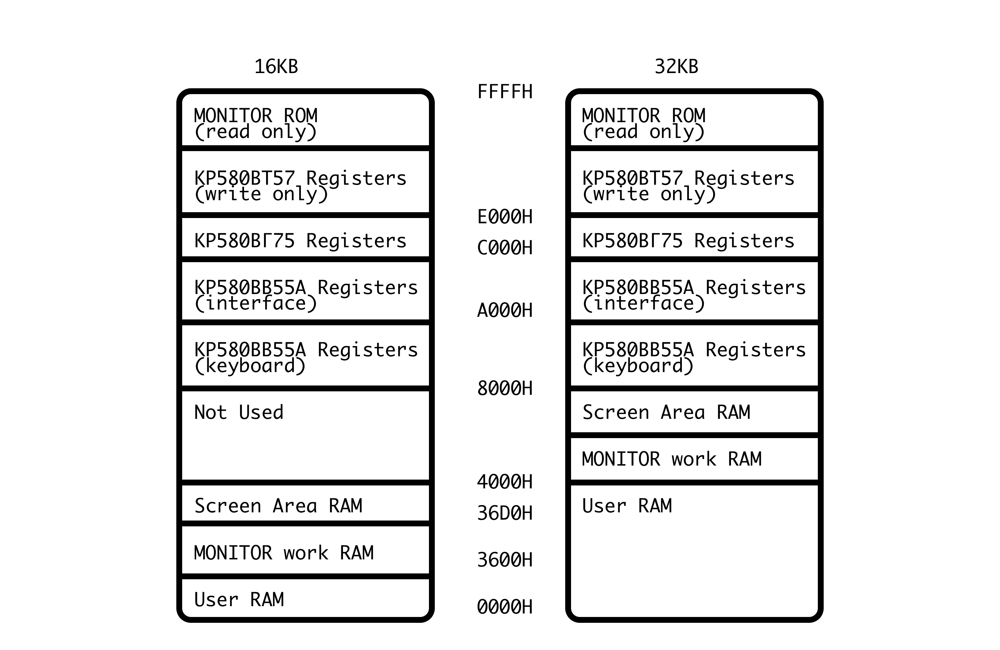

# УМПК-Р (UMPK-R) Computer
Information about the Soviet Ukrainian computer based on the Soviet homebrew computer called the [РАДИО-86РК](https://github.com/skiselev/radio-86rk) (RADIO-86RK).  I'll refer to it as the "RK" (Radio Computer) for the rest of this description.  This computer utilised the Soviet equivalent of the Intel 8080A called the КР580ВМ80А. 

My computer doesn't work so I need to troubleshoot, hence this translation work.  The Soviets were very good in including schematics & documentation how the computer works. 

There were quite a few industrially produced clones of the RK design so understanding how it works can help with troubleshooting other machines. 

## My YouTube Videos (As of 9-Mar-2025)
- [УМПК-Р (UMPK-R): Part 1 (First Look)](https://youtu.be/Kr2Yl7z__qQ)
- [УМПК-Р (UMPK-R): Part 2 (Trying to get video output)](https://youtu.be/anAznSh7gso)
- [УМПК-Р (UMPK-R): Part 3 (Video output troubleshooting continues)](https://youtu.be/vZf2vCqavNA)
- [УМПК-Р (UMPK-R): Part 4 (Faulty DRAM?)](https://youtu.be/Y1xS1cXXh0Q)

## English Documentation
I have done a partial translation (thanks to Grok) of the Operation Manual - original scanned Russian, my cleaned-up Russian and the translated English manuals can be found here.  There are four file types:
- Apple Pages (native)
- PDF
- Rich Text Format
- MS Word

Note that there may be errors in my cleaned-up Russian copy ... some words in the scanned manual disappeared into the page binding! 

Question: what on earth is "foiled lavsan" (фольгированный лавсан)? 

_"Lavsan" is a Russian trade name for a type of polyester film, chemically known as polyethylene terephthalate (PET). It is similar to materials like Mylar in Western terminology. "Фольгированный" means "foiled" or "coated with foil," indicating that the lavsan film has a thin layer of metal foil (often aluminium) applied to it. In the context of the УМПК-Р keyboard device, this refers to a metallised polyester film used in the membrane keyboard construction, where the foil provides conductive tracks or contacts for key operation._ 

_So, in technical terms, it could be described as "metallised polyester film" or simply "foiled PET film", depending on the context._

In the English translation I have kept the Soviet/Russian part identifiers rather than transliterate them, but I have included Western equivalent part identifiers as well. 

The scanned Russian manual includes the tables & diagrams referred to in the translation.  It also includes a map of the parts on the motherboard. 

I have also included some very-roughly machine translated (Google image) pages from the original Soviet RADIO magazine that explain the RK's functionality - I hope to come back and do better translations. 

## Memory Layout

## Map of ICs

